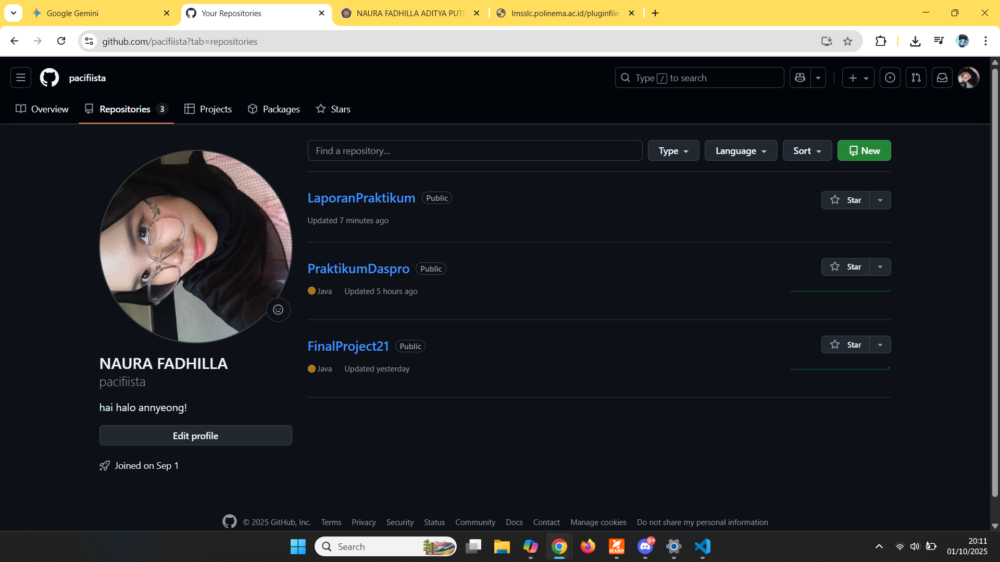
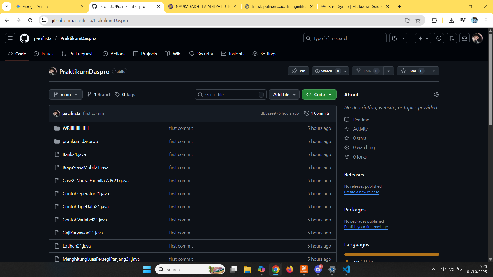
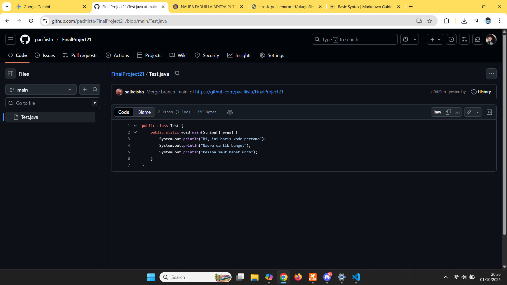
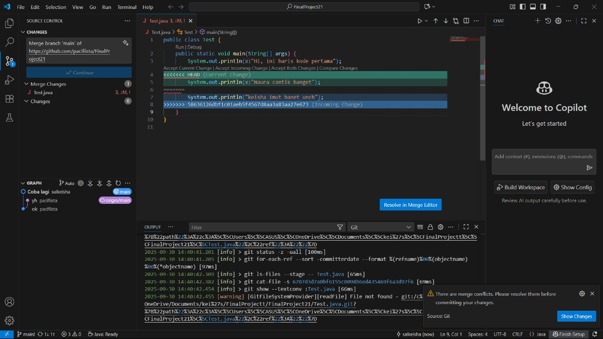
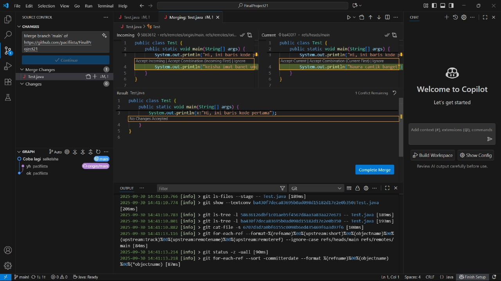

# Jobsheet 4 Version Control System
 <h1> Nama   : Naura Fadhilla Aditya Putri </h1>
 <h3> Nim    : 254107020007 </h3>
 <h3> Kelas  : TI-1C </h3>

 ## 2.1 Percobaan menggunakan Github
 Setelah mengikuti modul Jobsheet 4 dari awal pembuatan akun Github hingga menguji fungsionalitas kode berikut ialah hasilnya:

### Pertanyaan
1. Cek apakah file Test.txt ada di Github. Jika tidak, mengapa?
2. Jelaskan fungsi dari Add, Commit, dan Push!

### Jawaban
1. ya, ada banyak sekali file yang bernama Test.txt di Github, karena sering digunakan untuk pengujian sementara. dan file ini berisifat umum karena digunakan sebagai file sementara yang berisikan data tidak pentik setelah pengujian sering kali dihapus, dan juga nama generik saat mengetes program membutuhkan file teks sederhana untuk menguji fungsionalitas kode.

2. Fungsi add, commit, dan push:
- **fungsi add** : untuk memasukkan perubahan yang telah Anda buat pada file  ke dalam sebuah area yang disebut Staging Area. Stagging area adalah  area perantara sebelum perubahan benar-benar disimpan permanen.
    > contoh perintah:
    > git add nama_file.txt (untuk menambahkan satu file)
    > git add .  (untuk menambahkan semua file)

- **fungsi commit** : untuk menyimpan perubahan secara permanen di repository lokal. Setiap kali Anda melakukan commit, Anda wajib menyertakan pesan yang deskriptif. Pesan ini berfungsi sebagai catatan untuk menjelaskan perubahan apa yang Anda lakukan.
    > contoh perintah:
    > git commit -m "first commit"

- **fungsi push** : untuk mengunggah (upload) semua commit yang telah Anda buat di repositori lokal ke remote repository (server seperti GitHub, GitLab, atau Bitbucket).
    > contoh perintah:
    > git push origin main

## 2.2 Dasar Kolaborasi di Github
Untuk mencoba kolaborasi, saya mengundang teman saya untuk mencoba dengan membuat Repository dengan nama "FinalProject21"
berikut ialah hasil kolaborasi saya dengan teman:

kemudian kami menguji Merge Conflict dengan cara melakukan perubahan pada baris yang sama (atau berdekatan) pada sebuah file. 
Maka akan terjadi seperti ini:

- Current Change berwarna hijau adalah
version di local repository Anda sementara Incoming Change berwarna biru adalah
version yang ada di Github.

- dapat memilih version yang diinginkan pada bagian Incoming (klik Accept
Incoming | Accept Combination(Incoming First) | Ignore) atau bagian Current (klik
Accept Current | Accept Combination(Current First) | Ignore) kemudian modifikasi secara
manual di bagian Result jika diperlukan.
